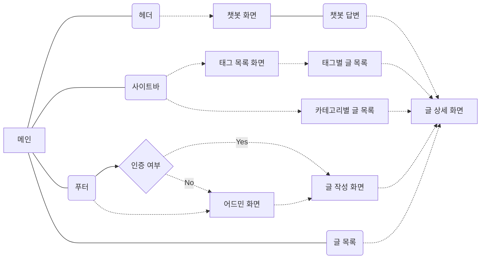

# 나만의 블로그 + 챗봇 프로젝트 플로우 차트

```mermaid
flowchart LR
  Home[메인]
  Sidebar(사이트바)
  Header(헤더)
  Footer(푸터)
  List(글 목록)

  Home --- Header
  Home --- Footer
  Home --- Sidebar
  Home --- List

  Create[글 작성 화면]
  Admin[어드민 화면]
  Chatbot[챗봇 화면]
  ChatbotResult(챗봇 답변)
  Detail[글 상세 화면]

  Authorize{인증 여부}

  TagList[태그 목록 화면]
  Tag[태그별 글 목록]
  Category[카테고리별 글 목록]

  Header -.-> Chatbot --- ChatbotResult -.-> Detail
  Sidebar -.-> TagList -.-> Tag -.-> Detail
  Sidebar -.-> Category -.-> Detail
  Footer --> Authorize -.-> |Yes| Create -.-> Detail
  Authorize -.-> |No|Admin
  Footer -.-> Admin -.-> Create

  List -.-> Detail

```

