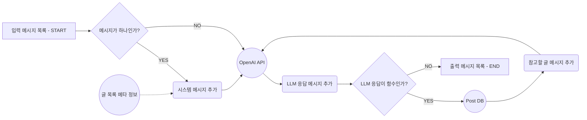

# 나만의 챗봇 답변 플로우

```mermaid
graph LR
  Input["입력 메시지 목록 - START"]
  Output["출력 메시지 목록 - END"]
  LLM((OpenAI API))
  PostDB((Post DB))
  IsFirst{메시지가 하나인가?}
  System(시스템 메시지 추가)
  Response(LLM 응답 메시지 추가)
  IsFunction{LLM 응답이 함수인가?}
  PostResult(참고할 글 메시지 추가)
  PostListMetadata((글 목록 메타 정보))

  Input --> IsFirst
  IsFirst --> |YES|System --> LLM
  IsFirst --> |NO|LLM

  PostListMetadata -.-> System
  LLM --> Response
  Response --> IsFunction

  IsFunction --> |YES|PostDB --> PostResult --> LLM
  IsFunction --> |NO|Output

```
